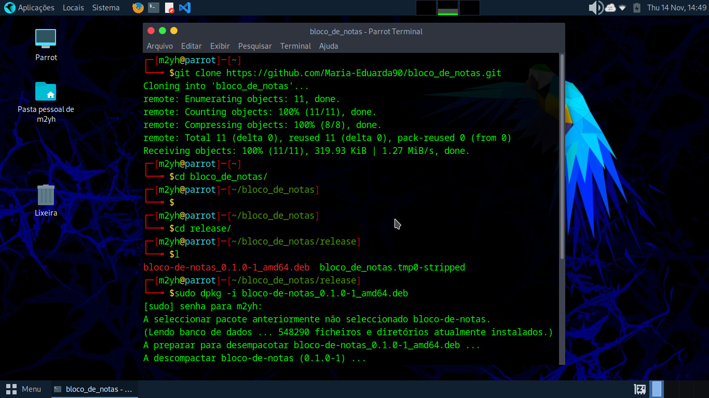
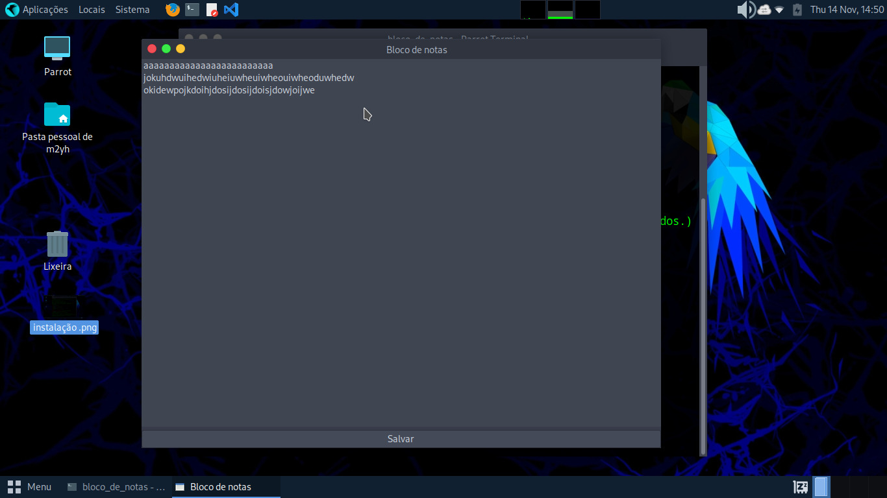

<h1 align="center">
  Bloco de notas
</h1>

<p align="center">
 

  
</p>

### Como Instalar

```bash
# clone o repositorio
$ git clone https://github.com/Maria-Eduarda90/bloco_de_notas.git

# Vá para a pasta
$ cd /bloco_de_notas/release

# Comando para instalar
$ sudo dpkg -i bloco-de-notas_0.1.0-1_amd64.deb

# Caso haja dependências faltando, execute:
$ sudo apt-get install -f

# No terminal digite o nome do aplicativo para usar
$ bloco_de_notas

# Para rodar o aplicativo em modo background
$ bloco_de_notas &

```

</br>

<h1 align="center"> 
	Projeto
</h1>

<h1 align="center">
  
</h1>

<h1 align="center">
  
</h1>